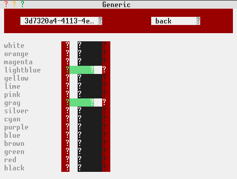
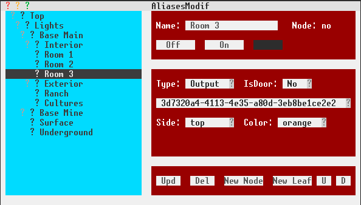
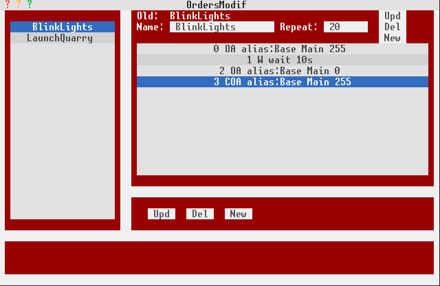

# wincraft

Poorly named, Wincraft is software to control the state of wires in MC and create windows to manipulate those states without requiring any programmation knowledge. 

## Features:
* multi-users and multi-screens with synchronized data
* advanced control and automation features
* replaces programming by intuitive screens
* data is saved automatically

## Architecture:
* one server that controls and reports the state of the wires
* one or more clients displaying data and allowing users to interact with the server
* transparently uses lan or wi-fi

## Requires:
* Opencomputers 1.7.10 up to 1.12.2
* Project Red or such wires

## Basics of signal:
* The server is connected to [redstone block(s)](https://ocdoc.cil.li/block:redstone_io) via special [cables](https://ocdoc.cil.li/block:cable) 
* Signal cables are connected to sides of that (those) redstone block(s)
* Each cable contains 16 different colored wires
* The server individually reports and modifies the state of those colored wires

# Standard wincraft screens:

## Generic screen:
It's aim is to display and allow changing the state of wires (0 (off) - 255 (on))
The user chooses a redstone block and a side after which the window displays the state of the 16 wires concerned and allows the user to switch their state

## Aliases screen:
This window aims to create, modify and set the state of aliases. An alias is a node or a leaf of a tree item (think directory).
A node can contain nodes and leaves while a leaf references a specific wire.

### Aliases have 2 roles:
* more readable than a triplet of redstone block/side/wire (just like an URL is more readable than an IP address)
* allows regrouping wires so one command can change all of them
* aliases are executed on the server in a different thread

### Content:
* output... forget about that, will probably disappear in the future
* IsDoor: allows to make sure doors are opened or closed (different rules than the rest)
* triplet of redstone block/side/wire
* buttons to to turn the alias on or off. Displays the state of a leaf. A node will effect all the leaves contained

## Orders screen:
Orders contain order commands. Executing an order will create a thread on the server and then execute the order commands in their respective order. An order can be killed. Repeat will repeat all the commands the specified amount of times.

### type of order commands:
* output: sets the state (0-255) of a triplet (redstone block/side/wire)
* outputAlias: sets the state (0-255) of an alias and all it's leaves if it's a node
* wait: sets an amount of seconds to wait
* input: waits for the state of the specified wire to be >= of the specified state
* execOrder: executes the specified order
* killOrder: ends the specified order
* cleanOut: clean commands are executed at the end of ther list of commands and if/when a command is killed.
* cleanOAl: same as cleanoput but uses an alias
* cleanW: same as wait but executed at the end or when an order is killed

### type of order commands linked to variables:
They will make more sense after reading the doc on the variables window
* varSet: sets a variable. A number can be set, incremented and decremented by a value. Strings, booleans, alias and order types can be set depending on their type. 
* execVAl: equivalent to outputAlias but to the alias the specified variables equals to
* execVOr: equivalent to execOrder but to the order the specified variables equals to
* inpVar: equivalent to input but listens for a change of value for the specified variable
* trigVar: triggers any inpVar listening for the specified variable

## Orders List screen:

