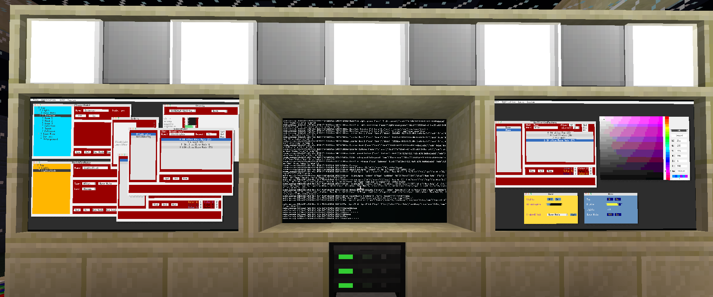
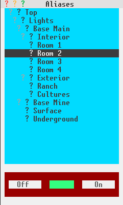
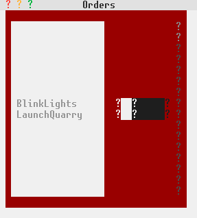
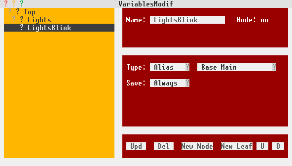
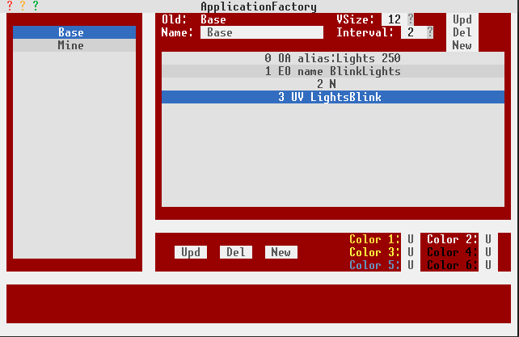
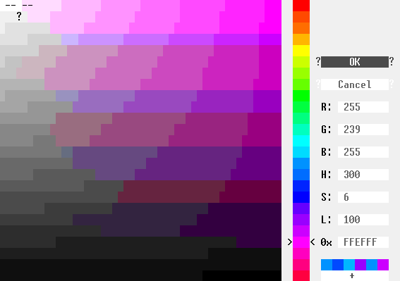

# Wincraft

Poorly named, Wincraft is software to control the state of wires in Minecraft and create windows to manipulate those states without requiring any programmation knowledge. 

## Features:
* multi-users and multi-screens with synchronized data
* advanced control and automation features
* replaces programming by intuitive screens
* data is saved automatically
* License is MIT

## Architecture:
* one server that controls and reports the state of the wires
* one or more clients displaying data and allowing users to interact with the server
* transparently uses lan and/or wi-fi

## Requires:
* Opencomputers 1.7.10 up to 1.12.2
* Project Red or such wires

## Basics of signal:
* The server is connected to [redstone block(s)](https://ocdoc.cil.li/block:redstone_io) via special [cables](https://ocdoc.cil.li/block:cable) 
* Signal cables are connected to sides of that (those) redstone block(s)
* Each cable contains 16 different colored wires
* The server individually reports and modifies the state of those colored wires

# Standard wincraft screens:

## Generic screen:
It's aim is to display and allow changing the state of wires (0 (off) - 255 (on)).
The user chooses a redstone block and a side after which the window displays the state of the 16 wires concerned and allows the user to switch their state.

## Aliases screen:
This window aims to create, modify and set the state of aliases. An alias is a node or a leaf of a tree item (think directory).
A node can contain nodes and leaves while a leaf references a specific wire.

### Aliases have 2 roles:
* more readable than a triplet of redstone block/side/wire (just like an URL is more readable than an IP address)
* allows regrouping wires so one command can change all of them
* also, aliases are executed on the server in a different thread

### Content:
* output... forget about that, will probably disappear in the future
* IsDoor: allows to make sure doors are opened or closed (different rules than the rest)
* triplet of redstone block/side/wire
* buttons to to turn the alias on or off. Displays the state of a leaf. A node will effect all the leaves contained

## Alias List screen:
Simple screen to display and modify the state of aliases.

## Orders screen:
Orders contain order commands. Executing an order will create a thread on the server and then execute the order commands in their respective order. An order can be killed. Repeat will repeat all the commands the specified amount of times.

### Type of order commands:
* output: sets the state (0-255) of a triplet (redstone block/side/wire)
* outputAlias: sets the state (0-255) of an alias and all it's leaves if it's a node
* wait: sets an amount of seconds to wait
* input: waits for the state of the specified wire to be >= of the specified state
* execOrder: executes the specified order
* killOrder: ends the specified order
* cleanOut: clean commands are executed at the end of ther list of commands and if/when a command is killed.
* cleanOAl: same as cleanOut but uses an alias
* cleanW: same as wait but executed at the end or when an order is killed

### Type of order commands linked to variables:
They will make more sense after reading the doc on the variables window
* varSet: sets a variable. A number can be set, incremented and decremented by a value. Strings, booleans, alias and order types can be set depending on their type. 
* execVAl: equivalent to outputAlias but to the alias the specified variable equals to
* execVOr: equivalent to execOrder but to the order the specified variable equals to
* inpVar: equivalent to input but listens for a change of value for the specified variable
* trigVar: triggers any inpVar listening for the specified variable
* ifV_A: if a boolean variable is in the specified state then a specified Alias will be set to the specified state
* ifV_O: if a boolean variable is in the specified state then a specified order will be executed

## Orders List screen:
Lists all recorded orders, displays their state (running or not) and allows starting and killing them. NB, they end by themselves when they have executed all their commands.

## Variables screen:
Variables can be created and their value set from this window. They are organized in a tree.

### Type of variables:
* number
* string
* boolean
* alias
* order

### Content of the window:
* name
* node or not
* type
* save: variables whose data is changed though this window always have their changes saved on hard drive (permanent). But not forcefully if changed from elsewhere (order or custom application) for performances reason. This variable controls if a variables value change is always saved on hard drive.
* value. What value can be contained will depend on the type

Caution: variables can make the program crash if pointing towards aliases or orders that don't exist anymore. I need to protect against that but haven't yet.

## ApplicationFactory screen
This window permits the creation of custom applications that can be found under the Custom menu. Those are created for the computer on which they were created and not synchronized/saved elsewhere. It's a vertical list of controls.
First, you give it a name, then a vertical size and distance between vertical elements.
Then, you add the controls you want to see appear. 

### Control options:
* output: a title, a triplet (redstone block/side/wire) and a charge when on (off is 0) - allows controlling it
* outAlias: same for an alias
* execOrder: order to control
* display: a title, a triplet (redstone block/side/wire) and a charge when on (off is 0) - only displays the info
* nothing: adds a vertical space
* variable: displays the value of a variable
* updVar: displays and allow modifying the value of a variable
* disMul: displays the state of wires of a block/side belonging to the specified range of colors

This screen enables the changing of the colors of the produced application.

This will result in, for example:

You can create as many custom applications as you wish.

NB1: custom windows won't react properly if you have 2 controls dealing with the same wire in the same application. Alias nodes can bypass that limitation.
NB2: it's is easy to crash wincraft by creating custom applications that use an order, alias or variable that you then rename or delete.

## Documentation and about screens:
Those are to be found under the Help menu.

# Installation

## Hardware
You will need at minimum a server and one client to run wincraft.
Either have the server and it's client(s) on a lan or equip them all with a wifi network card. Mixing can work too.
You can locate all the computers inside a server rack if you want or not. 
The server needs to have at least one [redstone block(s)](https://ocdoc.cil.li/block:redstone_io) connected
NB on a previous version of Opencomputers, there was a bug where wifi cards wouldn't be able to communicate between computers inside a rack so if you use that solution, make sure to get the last version of the mod.

## Software:

### Manual
* click on "releases" (up there) and choose the last release.
* extract all files from /etc into /etc and files from /usr into /usr

### Automated through OPPM
* you need to have OPPM installed on the computer
* oppm register schloops1/wincraft
* oppm install wincraft

### Additional actions
* if you are running on a 1.7.10 version of minecraft, you need to set the variable higherThan_1_7_10 (contained in the /home/wincraft/server/settings.json file of the server) to false.
* edit server's /home/.shrc file and set it's content to: /usr/bin/wincraft/server/srv
* edit all client's /home/.shrc file(s) and set it's (their) content to: /usr/bin/wincraft/client/client

If you want some errors to display on the screen of the client, modify client.lua so that "local safe = true" becomes "local safe = false" .
Client and server have a setting.json file where you can set a debug variable to true if you wish for loging to be written to log.txt. 
They also contain the variable port you can use if you want to set a different port or have multiple wincraft separated networks running together.

# Warning:
This is for private networks. It is not suited for public networks where you can't trust all users as it certainly could be abused to crash the server. It is possible to crash the wincraft client but no data loss should occur so you can simply restart it. The wincraft server can be crashed with variable shenanigans but equally, no data loss should occur. I'll add additional security to counter that.
Anyway, it's perfectly useable as it currently is in friendly singleplayer/multiplayer environments.
* srv -enter or client-enter to launch the programs manually

## Third party libraries used:
* https://github.com/IgorTimofeev/GUI
* https://github.com/rxi/json.lua

## Thanks to:
* OpenComputers's developers
* IgorTimofeev and rxi for their library
* Vexatos for his help with OPPM
* anybody that uses this program
